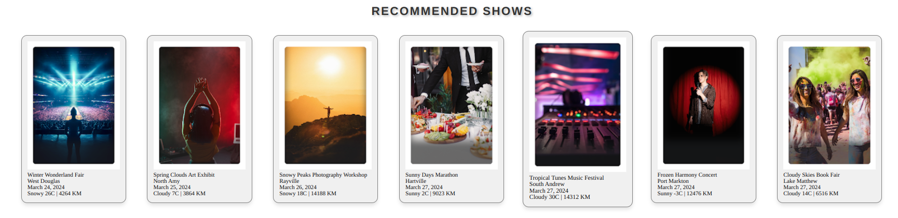
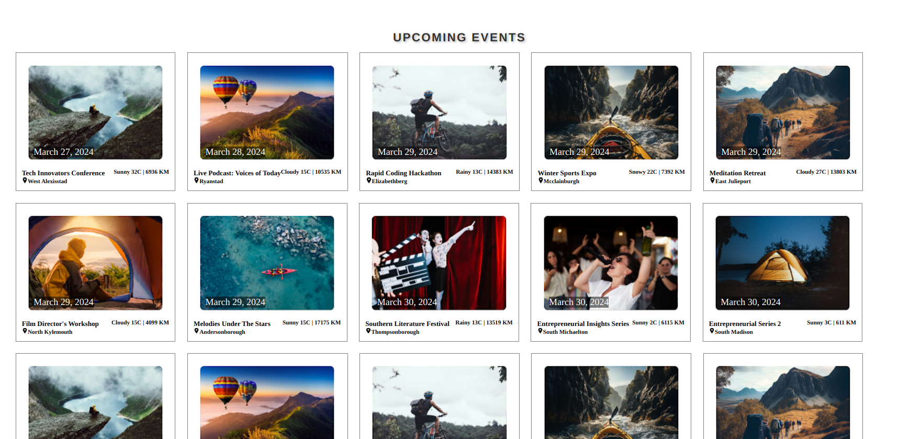
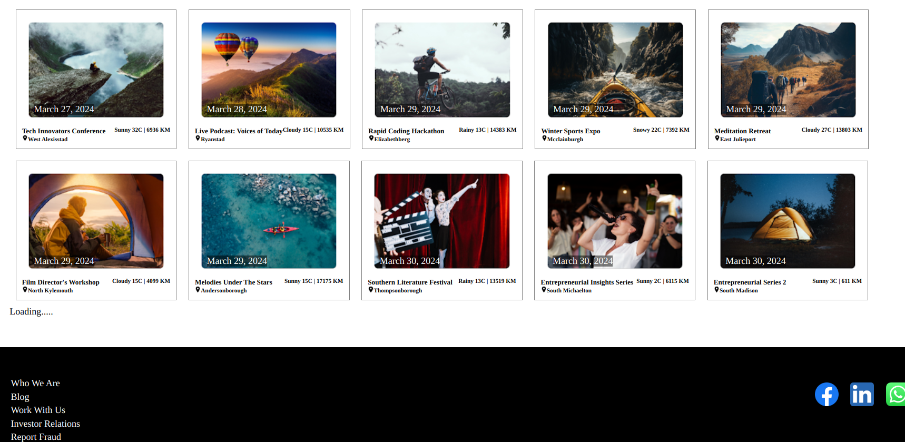
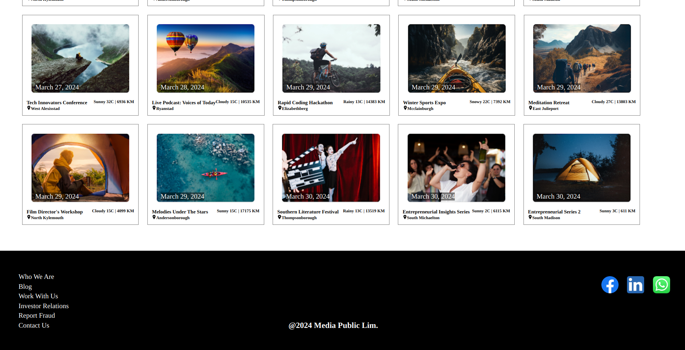

## Links

- Live [https://food-zjio.vercel.app/](https://food-zjio.vercel.app/)
- Backend [[https://github.com/anuragdw710/EventBackend]](https://github.com/hydra-Cody/EventbookingBackend)
- Frontend [https://github.com/anuragdw710/EventBooking](https://github.com/anuragdw710/EventBooking)

## BookUsNow

- A responsive event booking website built with React.js, JavaScript, and CSS. This project features seamless API integration, optimized performance, and an enhanced user experience through advanced web development techniques.

## Features

- Responsive Design: The website is fully responsive, ensuring a smooth user experience across different devices and screen sizes.
- API Integration: Integrated with external APIs to fetch and display event data dynamically.
- Performance Enhancements:
  - Shimmer Effect: Implemented shimmer loading placeholders to improve perceived load times while data is being fetched.
  - Horizontal Scrolling: Enabled horizontal scrolling to showcase event categories or featured events in a user-friendly manner.
  - Lazy Loading: Incorporated lazy loading for images and other assets to boost performance and reduce initial load times.

## Technologies Used

- React.js: A JavaScript library for building user interfaces.
- JavaScript: The core scripting language used to implement functionality.
- CSS: Styling the application to ensure a visually appealing and responsive design.

Pages:










## Setup

```
To run localy
- git clone https://github.com/anuragdw710/EventBooking.git
- cd EventBooking
- npm install
- npx parcel index.html
To build
- npm run-script build
```


## E-Ticketing Service
You've been tasked to develop a streamlined e-ticketing solution for concerts, sporting events, and theater
performances. This service aims to revolutionize the ticket purchasing process, offering a smooth and secure
way for patrons to secure their spots at sought-after events.


## Frontend (React.js)
1. Develop a user-friendly interface for browsing and searching available events.
2. Create a reusable component to display event details with an interactive seat map for selection.
3. Design a secure form for patrons to register an account and manage their profiles.
4. Implement a checkout page where patrons can review their selected tickets and proceed with the
purchase.
5. Create a dynamic profile section for patrons to view their order history and download tickets.
6. Develop a mechanism to provide visual feedback to the patron during the ticket booking process.
7. Utilize a state management solution to effectively share data between components.
8. Implement smooth transitions and animations to enhance the user experience.
9. Ensure that form inputs are validated before submission to prevent invalid data from reaching the backend.
10. Design a comprehensive error handling system to gracefully display error messages to the patron.

